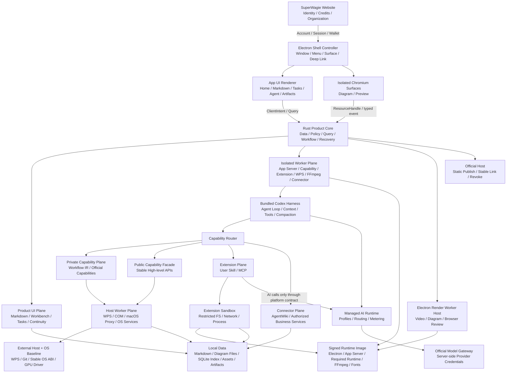

# 超级牛马（SuperWagie）最早期产品方案 V0.1

> 状态：产品与架构基线，供后续设计讨论使用  
> 确认日期：2026-08-28  
> 来源：[界面风格与 GitHub 查询](chatgpt-conversation://6a8fe9a0-e3bc-83e9-b952-28b9d8d313e6)及后续确认  
> 本文不是实施计划。标为“基线约束”的内容后续若要改变，应明确记录新的决策；标为“候选”的技术选型仍需验证。

Production Implementation Plan 有两个并列前置门：一是界面原型和关键用户流程逐屏确认；二是[技术可行性调查](技术可行性/README.md)完成逐项论证并通过必要 PoC。Technical Validation Plan 不受这一禁止限制，可以先实现可丢弃 PoC、fixture、契约测试和探针；任何一门未通过，都不能把这些验证代码直接标记为生产能力。

## 1. 产品定义

超级牛马（SuperWagie）是一款闭源、零配置、一体化的本地 AI 工作空间。

命名基线：中文产品名为“超级牛马”，英文产品名为 `SuperWagie`；代码、目录、协议和机器标识继续统一使用 `superwagie`。

产品的技术定义是：

> 以 Codex Harness 为智能内核，以 Markdown Workspace 为数据底座，以官方能力与开放扩展为能力层的 Rust 桌面 Agent。

产品不是一个需要用户组装的 Agent 工具箱，也不是“聊天框 + Markdown 编辑器”，而是一台直接完成知识工作的 AI 工作机。

普通用户只需要理解三个概念：

- 账号；
- Agent；
- Credits。

模型、Provider、API Key、Base URL、Token、上下文窗口、MCP 配置、底层 Harness 和内部工作流均不进入普通用户的产品认知。

## 2. 核心产品原则

以下内容属于基线约束。

### 2.1 用户只描述目标

用户打开客户端、登录并直接向 Agent 提出任务。平台负责决定使用哪些能力、模型、工具和工作流，最终交付本地文件或完成指定操作。

### 2.2 官网与客户端职责分离

官网负责：

- 产品介绍和客户端下载；
- 注册、登录与账户；
- Credits 充值与消耗查询；
- 订单、账单和发票；
- 企业组织、成员及额度管理。

桌面客户端负责：

- Agent 工作流；
- Markdown Workspace；
- 笔记、知识整理与搜索；
- 任务管理；
- PPT、Word、HTML、视频、PDF 等成果生产；
- 官方能力与 Private Workflow、用户 Skill 和 MCP；
- 用户授权范围内的本地文件与桌面应用操作。

一句话概括：

> 官网负责 Identity、Money、Organization；桌面客户端负责 Work。

### 2.3 能力生态开放，AI Runtime 封闭

用户可以扩展“做什么”，但不能扩展“用哪个模型、哪个模型接口或哪个 API Key”。

官方能力在开发期可以使用传统 Skill、MCP 和 Workflow 形态；生产用户可安装的扩展只限 Skill 和 MCP。两者都必须运行在 SuperWagie 定义的权限、网络和模型边界内。“兼容传统扩展”指开发格式和调用范式兼容，不代表无限权限兼容。

### 2.4 本地文件归用户所有

Markdown 文件是笔记、知识和项目语义内容的唯一真实来源。Excalidraw、draw.io、Office、图片等结构化 Artifact 使用各自开放或可迁移的文件格式作为真实来源。数据库不保存第二套用户语义内容；它可以保存可重建索引和为恢复、幂等、计费、审计必须留存的 Operational Record，两者必须分表、分生命周期管理。用户即使离开 SuperWagie，也能继续访问自己的内容和成果。

### 2.5 Agent 只能操作用户明确交付的范围

沙箱不是为了阻止 Agent 操作本地文件，而是确保 Agent 只操作用户主动交给当前 Workspace 的文件和应用能力。

### 2.6 内置技能的产品形态与执行形态分离

用户可以统一把 SuperPPT、SuperWriter、视频制作、Excalidraw、draw.io、SessionReviewer 等理解为“内置能力”，但平台内部不能把它们扁平化为同一种脚本包。每项能力应根据真实边界实现为私有 Workflow、确定性 Capability、客户端原生模块、Trusted Host 适配器或远程 Connector。视频制作使用 SuperWagie 独立实现的轻量 Workflow、Scene IR 和帧渲染内核；OpenMontage 与 Remotion 只作为研究参考，不进入生产代码、Runtime 或 UI。日历、待办、项目和统计不是独立能力，统一属于主工作台。

## 3. 产品形态与用户体验

### 3.1 最短使用路径

```text
下载客户端
→ 登录
→ 提出任务
→ Agent 完成工作
→ 自动扣除 Credits
→ 余额较低时提醒充值
→ 充值后继续使用
```

客户端不要求用户完成模型、Provider、Skill、MCP 或 API Key 配置。

### 3.2 客户端主要模块

- Home：个人 AI 工作台和近期工作入口；
- Markdown Workspace：本地资料、笔记和项目内容；
- Agent：任务沟通、执行进度与结果交付；
- Tasks：一级任务管理模块，统一用户手动、Agent 对话和 Project Milestone 自动创建的 Markdown 任务；
- Diagrams：内置 Excalidraw 与 draw.io 编辑、预览和导出；
- Artifacts：PPT、Word、HTML、视频、PDF、图片等成果中心；
- Account：登录状态、Credits、消费记录入口与退出登录；
- Settings / User Extensions：设置中的高级子页，只管理用户添加的 Skill 和 MCP；不是独立工作模块，也不展示系统内置能力。

支付、税务和发票流程留在官网，客户端通过已登录的网页打开对应页面。充值完成后客户端自动刷新余额。

### 3.3 视觉方向

整体使用“暖调编辑式极简 + Bento 卡片工作台 + 轻柔 Soft UI”的视觉语言：

- 象牙白、奶油白和米灰背景；
- 编辑排版式衬线标题；
- 克制的暗红或灰粉色点缀；
- 淡边界、柔和阴影和大量留白；
- 首页以不同尺寸的卡片呈现日历、任务、项目、知识和成果；
- 首页“开始工作”严格采用原始 I2：位于 Bento 网格左上角的紧凑深色卡片，标题在上、短输入框在下；不采用大通栏、标题与输入框并排或后来重画的变体；
- 保持安静、专业、有个人工作室质感，避免传统开发者控制台观感。

## 4. 总体架构



Electron Main 属于客户端可信计算基，但只是可信、非业务权威的 Shell Controller；Rust Product Core 是业务、数据与策略的唯一权威。任何高风险或长时执行都进入受 Core 监管的隔离 Worker，Renderer 只通过类型化 Query、ClientIntent 和短期 Resource Handle 交互。

## 5. 独立封闭的 Agent Runtime

这是 SuperWagie 的强制性架构约束。

本节所称“封闭”是指 Agent 核心、控制面、状态和参数独立，不是把所有第三方库和公共 Runtime 都复制进安装包。总体原则是：

> 核心封闭、依赖共享、配置隔离。

SuperWagie 必须携带并启动自己的 Agent 核心运行环境，绝不复用机器上已有的 Codex Server、Codex CLI 或其他 Agent 核心。机器上已有的 Agent 配置、服务、插件和版本不得改变 SuperWagie 的运行结果。

### 5.1 隔离要求

- 固定打包并锁定经过 SuperWagie 验证的 Codex App Server 版本；
- 通过应用内部的绝对路径启动 Runtime，不从系统 `PATH` 查找 Codex；
- 使用 SuperWagie 独立的配置、状态、缓存、日志、会话和扩展目录；
- 不读取机器上的 `~/.codex`、全局 Skills、MCP、插件、Agent 配置或用户级指令；
- 不复用正在运行的 Codex Server，不连接其端口、Socket 或进程；
- 客户端与 Runtime 默认通过私有 stdio 双向通信，不开放公共网络端口；
- 使用独立进程树，不附着到其他 Agent 进程；
- 不继承可能改变 Agent 行为的宿主环境变量，仅注入显式白名单；宿主的 `CODEX_HOME`、模型配置和 Provider 凭证不得进入 Runtime；
- 模型出口、工具集合、系统策略、沙箱策略和 Runtime 更新均由 SuperWagie 控制；
- SuperWagie 与机器上的其他 Codex 或 Agent 可以同时运行，互不发现、互不调用、互不影响。

逻辑边界如下：

```text
机器上的 Codex CLI / Codex Server / Skills / MCP / Config
                              │
                              ✕
                              │
┌────────────────────────────────────────────────┐
│                   SuperWagie                     │
│                                                │
│ Electron Shell Controller                      │
│       ↓ authenticated private channel          │
│ Rust Product Core                              │
│       ├────────→ Pinned Codex App Server Worker│
│       ├────────→ Capability / Extension Worker │
│       ├────────→ WPS / FFmpeg / Connector Worker│
│       └────────→ Electron Render Worker Host   │
│                    ↓                           │
│ Signed Runtime Image + verified External Hosts │
│       ↓                                        │
│ SuperWagie Config / State / Sandbox / Tool Set │
│       ↓                                        │
│ SuperWagie Managed AI Gateway                  │
└────────────────────────────────────────────────┘
```

### 5.2 明确允许的外部边界

封闭 Runtime 并不意味着与操作系统完全断开。以下外部资源可以通过受控接口使用：

- 用户主动授权的 Workspace 和附加文件夹；
- WPS 等由 Rust Product Core 授权、隔离 Host Worker 执行的桌面应用；
- 用户明确启用、且经过权限控制的业务服务；
- SuperWagie 官方账户、Credits 和模型网关。

如果未来某项能力必须使用本地 Socket，应为每个 SuperWagie 会话生成独立路径和鉴权令牌，不能退化为复用公共 Codex 服务。

### 5.3 产品级共享 Runtime 与外部宿主策略

SuperWagie 不为每个 Skill、脚本和文档能力重复打包一套运行时。依赖固定分为四层：

1. **OS Baseline**：系统 API、证书库、GPU 驱动和受支持系统稳定 ABI；只按平台基线使用，不把用户安装的语言包当作内置能力依赖；
2. **Signed Runtime Image**：Electron/Chromium、App Server、V1 能力依赖图实际需要的 Python/Node、FFmpeg/codec、必要字体、签名静态资源和锁定制品；随基础安装一次、只读、可校验并由内置能力共享；
3. **External Host**：WPS/Office、Windows COM、macOS Automation、Git 等不能或不应随包分发的宿主；按绝对路径、版本、签名/身份和 feature probe 使用，缺失时只禁用依赖能力；
4. **User Extension Environment**：用户明确安装 Skill/MCP 时，经 Installer Worker 建立的隔离环境；不污染 Signed Runtime Image，也不与内置能力共享可变包目录。

官方内置能力不得在执行任务或首次使用时运行 `npm install`、`npx`、`pip install` 或下载 Runtime。用户扩展也不得首次执行时补装依赖；依赖获取和构建必须发生在用户明确授权的扩展安装事务中。

“复用系统依赖”不等于继承整套系统 Agent 环境。SuperWagie 不得因此读取或复用：

- 系统 Codex Server、Codex CLI 或其他 Agent 服务；
- 系统 Agent 的模型、Provider、API Key 和 Base URL；
- 全局 Skill、MCP、插件、Prompt、Agent 指令和会话状态；
- 未经声明和校验的 Python/Node 全局包；
- 可能改变 Agent 行为的任意宿主环境变量。

每项 Capability 应声明依赖契约：

```text
Dependency
├── id
├── tier: os_baseline | signed_runtime | external_host | user_extension
├── compatible_versions
├── required_features
├── resolved_identity
├── integrity_policy
├── health_check
└── repair_or_availability_policy
```

运行前由 `Dependency Resolver` 统一处理：

```text
Capability
→ Read Dependency Manifest
→ Resolve from Signed Runtime Image or verified External Host
→ Verify absolute identity, version, integrity and required features
→ Run offline Health Check
→ Build Minimal Environment
→ Pass Explicit Executable Paths to Sandbox or Trusted Host
```

依赖解析遵循以下规则：

- 内置闭包优先：内置能力只使用 Signed Runtime Image 中锁定的语言 Runtime 与制品；不能回退到用户或系统全局 Python/Node；
- 显式解析：由 Resolver 解析并传入明确路径，业务代码不自行在随机 `PATH` 中查找；
- 最小环境：只传递当前能力必需的路径和环境变量；
- 安装完备：Signed Runtime Image 缺失或校验失败属于安装损坏，进入修复或回滚；任务执行和首次使用不得下载内置依赖；
- 外部宿主降级：External Host 缺失时只禁用相关能力并提供官方安装/重新检测入口；
- 扩展事务隔离：用户 Skill/MCP 依赖只在明确授权的安装/更新事务中建立，首次执行不得临时补装；
- 能力隔离：可共享 Runtime 二进制和公共库，但不共享 Agent 配置、参数、凭证和服务；
- 禁止错误回退：公共依赖缺失不能导致 SuperWagie 改用机器上的 Codex 或其他 Agent 环境。

Signed Runtime Image 只收录 V1 能力依赖图真正可达的闭包，并在 Rust 迁移完成后通过引用追踪裁剪；这既避免按 Skill 重复打包和无关工具链膨胀，也保证安装后内置能力可离线运行、可复现、可回滚。

## 6. Agent 基座

当前基线选择 Codex Harness，不再以 OpenCode 作为 Agent 基座，也不从零开发 Harness。

V1 的集成方式是：

```text
Rust Product Core
       │
       │ private stdio protocol
       ▼
Pinned Codex App Server
```

V1 不直接链接仍可能快速变化的 Codex 内部 crate。产品层应定义自己的 `Agent Runtime API`，屏蔽具体 Harness 的协议和生命周期：

- 启动和关闭会话；
- 发送任务；
- 取消或恢复任务；
- 接收流式事件；
- 提交工具结果；
- 管理上下文和压缩；
- 处理 Runtime 崩溃和重启。

Codex 的 Harness、上下文管理和工具循环可以复用，但默认的 Coding-first 行为必须通过真实知识工作任务验证和产品化。

## 7. 能力体系

### 7.1 三类能力

| 类型 | 主要用途 | 用户可见实现 | 用户可配置 | 运行环境 |
|---|---|---:|---:|---|
| Private Internal | 官方内部工作流和低层工具 | 否 | 否 | Trusted Runtime |
| Public/Restricted Platform | 提供给主 Agent 和用户扩展的高层能力 | 仅接口 | 仅业务参数 | Trusted Runtime |
| User Extension | 用户安装的 Skill、MCP | 是 | 受策略限制 | Extension Sandbox |

用户扩展可以调用官方公开的高层能力，但不能枚举、导出或直接执行内部 Workflow、Prompt、MCP 配置和低层 WPS 工具。

这里的三类是安全和可见性分类，不等于实现分类。官方内置能力可以分别由以下执行单元承载：

- Private Workflow：SuperPPT、SuperWriter、Video Courseware、Roundtable 等多阶段 Agent 编排；
- Deterministic Capability：图片幻灯片生成、可编辑幻灯片重建、自有帧渲染/FFmpeg 合成、文档解析和导出等确定性执行器；
- Native Client Module：Markdown、统一工作台、Excalidraw、draw.io、SessionReviewer 项目浏览等客户端原生交互；
- Trusted Host Adapter：WPS、Office、COM、macOS Automation、宿主图片生成和客户端验收；
- Connector：AgentWiki 等有独立身份、网络、同步和审计边界的远程服务连接器。

例如允许：

```text
artifact.presentation.create(...)
artifact.document.create(...)
artifact.video.create(...)
workspace.search(...)
task.create(...)
```

不允许：

```text
private.workflow.run("ppt-master")
private.prompt.read(...)
wps.raw_execute(...)
```

### 7.2 Capability Contract

所有能力使用统一逻辑结构：

```text
Capability
├── id
├── version
├── source
├── visibility
├── trust_level
├── execution_modes
├── input_schema
├── output_schema
├── permissions
├── runtime_dependencies
├── host_capabilities
├── secret_refs
├── egress_policy
├── workspace_mounts
├── artifact_contracts
├── ownership_marker
├── checkpoint_schema
├── resume_and_idempotency_policy
├── human_gate_schema
├── client_acceptance
├── billing_policy
└── executor
```

上层只依赖 Capability Contract，不依赖 Skill、MCP、Python、Node 或 Rust 的具体实现。

### 7.3 执行模式

一个 Capability 可以声明一种或多种执行模式：

| 模式 | 用途 | 典型能力 |
|---|---|---|
| `sandbox` | 受限文件、进程和网络中的确定性代码 | 解析、校验、离线构建、索引 |
| `agent_step` | 需要 Agent 推理、对话或宿主工具调用的语义步骤 | 大纲、访谈、评价、Roundtable |
| `trusted_host` | 必须接触受保护宿主工具、桌面应用或系统自动化 | imagegen、WPS、COM、客户端验收 |

同一工作流可以跨模式执行，但每次跨边界都必须使用显式请求、Artifact、权限和回执，不得靠共享宿主环境变量或隐式全局状态传递。

## 8. 官方 Skill 的研发与发行

### 8.1 研发形态

官方能力继续使用高效率的开放工具链开发：

```text
SKILL.md + MCP + Scripts + Templates + Evaluations
                         │
                    真实任务调试
                         │
                  Capability Contract
```

### 8.2 发行形态

调试成熟后，官方 Skill 被转译或封装为私有 Capability Package：

```text
SKILL.md / MCP / Prompt / Scripts
                 │
           Skill Compiler
                 │
          Private Workflow IR
                 │
       Capability Package / Rust App
```

安装包不直接发行可以复制给其他 Agent 使用的标准 `SKILL.md`。本地闭源软件无法保证绝对不可逆向，目标是避免能力被低成本复制和直接移植。

### 8.3 Workflow IR

Private Workflow IR 至少需要表达：

- Agent Semantic Step；
- Human Gate 与 Conditional Human Gate；
- Capability Invoke；
- Host Request Prepare、Host Tool Call 与 Host Artifact Commit；
- Render、Vision 与 Evaluate；
- Branch；
- Loop；
- Artifact；
- Checkpoint、Lease 与 Revision Snapshot；
- Outbound Disclosure 与 Client Acceptance；
- Compensating Rollback；
- Context、Retry、Permission、Resume、Idempotency 和 Billing Policy。

复杂 Agentic Skill 中的分析、批判、观察、返工和多轮 Agent 对话必须完整保留，不能简化成一次工具调用。

### 8.4 Durable Workflow Runtime

SuperPPT、SuperWriter、Video Courseware、Roundtable 等复杂 Skill 需要由持久化工作流运行时承载，而不是一次性脚本调用。运行时至少负责：

- 阶段状态和人工确认门；
- 稳定的文稿、章节、幻灯片和 Artifact ID；
- 上游内容修改后的依赖失效和局部重算；
- 不可变修订快照、回滚和失败证据；
- 单页、单章节或单成员级重试；
- Worker 崩溃后的恢复、租约接管和重复执行防护；
- Artifact staging、校验和原子提升；
- Credits 预留、实际用量回执和幂等结算；
- 用户可见的阶段时间线、预览、比较、批准、拒绝和返工入口。

已确认的首批内置能力按以下边界产品化：

| 能力 | 内部主要形态 | 基线说明 |
|---|---|---|
| SuperPPT | Private Workflow | 与 SuperWriter 同层；本地开发中，尚未发布到 GitHub；调用独立的图片生成、可编辑重建和演示文稿组装能力 |
| SuperWriter | Private Workflow | 保留分阶段写作、内容访谈、人工门和 WPS 交付闭环 |
| Video Delivery | Private Workflow + Versioned Renderer | 视频是第四类正式交付物；首发按优先级覆盖网站 Demo、教学课件、PPT 讲解、图片绘本和照片动态，统一由 Agent、Scene IR、帧渲染、媒体 QA 和 Review 驱动 |
| HTML Taste | Private Policy Pack + HTML Delivery Workflow | 参考并冻结 `leonxlnx/taste-skill` 的 MIT 许可设计规则，只用于 HTML 交付物的视觉方向、实现约束和质量预检；不用于 SuperWagie 客户端 UI，不在任务运行时下载外部 Skill |
| OpenMontage | Research Reference | 只研究 pipeline、stage director、Artifact 和质量门等公开行为；AGPLv3 代码、Prompt、模板和 Backlot 不进入生产依赖 |
| Remotion | Research Reference | 只研究确定性帧合成的一般原理；源码、npm 包、Studio、Player、Renderer 和 Editor Starter 不进入生产依赖 |
| codex-roundtable | Private Multi-agent Workflow | 保留角色、人设、串行讨论和纪要；具体模型由平台隐藏路由 |
| ai-image-to-ppt | Versioned Capability | 负责图片生成适配、规范化、视觉 QA 和图片型幻灯片导出 |
| image-to-editable-pptx | Versioned Capability | 负责精确单页输入的 OCR、Vision 和可编辑重建，不承担整套演示文稿编排 |
| WPSComposer | Capability + Trusted Host | 高层文档 ABI 与 COM、JSAPI、WPS 生命周期分离 |
| SessionReviewer | Native Continuity + Private Workflow | 原生消费 SuperWagie 结构化事件，生成项目回顾、项目历史和演化视图 |
| obsidian-excalidraw | Native Editor + Capability | 原生编辑器、Agent 图形操作、渲染验证及 Excalidraw 文件协议 |
| draw.io | Native Editor + Capability | 内嵌离线 diagrams.net 编辑器、结构化图表操作及 `.drawio` 导入导出 |
| AgentWiki / agentwiki-sync | Connector | AgentWiki 保持远程服务；SuperWagie 内置授权、预览、同步、冲突和审计连接器 |
| agentsoul | Native Profile + Safe Memory | 吸收身份、偏好和长期记忆概念，不修改 OpenCode 或其他宿主 Agent 配置 |

### 8.5 Host Capability Bridge

宿主图片生成、WPS 和客户端验收等能力不能伪装成普通子进程依赖。Host Capability Bridge 使用两阶段或多阶段协议，例如：

```text
Workflow Prepare Host Request
→ Trusted Host Executes Protected Capability
→ Host Returns Owned Artifact + Receipt
→ Workflow Validates and Commits Artifact
```

请求至少绑定 `request_id`、`workflow_revision`、业务对象 ID、输入哈希、尝试次数、权限范围和计费上下文。相同请求的重复提交只能验证并复用已有结果，不能无条件重写正式产物。

## 9. Managed AI Runtime

所有官方能力和用户扩展的 AI 调用都必须经过平台统一的 Managed AI Runtime。

### 9.1 用户和扩展不可使用的能力

- 替换或提供 API Key；
- 选择 Provider 或具体模型；
- 自定义 Base URL；
- 直连外部 LLM API；
- 启动 Ollama、llama.cpp、MLX 等本地模型；
- 读取官方模型凭证；
- 绕过官方 Credits 计量。

### 9.2 对 Skill 暴露的能力

Skill 只能通过平台契约表达需要的能力，例如：

```text
agent.run(...)
ai.reason(...)
ai.vision(...)
ai.generate_image(...)
ai.ocr(...)
ai.review_visual(...)
```

可以提供 `fast`、`balanced`、`reasoning`、`vision`、`creative`、`embedding`、`image` 等能力档位，但档位到具体模型的映射完全由平台控制。

### 9.3 凭证边界

真正的 Provider Key 只保存在服务器端。客户端只持有短期、可撤销、绑定账户或设备的访问令牌：

```text
Desktop Session Token
        ↓
SuperWagie Gateway
        ↓
Identity / Entitlement / Credits Check
        ↓
Server-side Provider Credentials
        ↓
Selected Model Provider
```

公开版本 Skill 中出现的 OpenAI、Gemini、Doubao、DashScope 等用户环境变量，在作为 SuperWagie 官方内置能力时必须改接 `Managed AI Runtime` 和 `Credential Broker`。官方能力只能获得短期能力句柄或单次调用结果，不能读取服务器 Provider Key，也不能让用户脚本继承这些凭证。

### 9.4 扩展网络限制

如果用户脚本同时拥有任意代码执行、任意网络和任意进程启动权限，就无法严格禁止其连接外部或本地模型。因此 Extension Sandbox 必须：

- 默认禁止任意网络；
- 通过 Network Broker 开放经过声明和批准的业务服务；
- 限制任意进程启动和 localhost 访问；
- 不向子进程传递官方凭证；
- 对模型代理、隐藏转发和本地推理进程进行策略阻断。

## 10. Credits、个人账户与企业账户

Credits 是统一消费单位，用于抽象 LLM、Vision、图片、搜索、云 API、计算资源和高级能力成本。普通用户不需要看到 Token 或具体模型账单。

本章保留产品级摘要；项目消费主体、组织角色、账本批次、预留结算、异常恢复与验收的唯一详细规格见 [账户、Credits 与企业组织设计](superpowers/specs/2026-08-29-superwagie-account-credits-organization-design.md)。

### 10.1 两套钱包

```text
User
├── Personal Wallet
│   ├── balance
│   ├── recharge history
│   └── usage history
└── Organizations[]
    ├── Organization Wallet
    ├── Members and Roles
    ├── Credit Policies
    ├── Usage Allocation
    └── Billing and Invoices
```

个人 Credits 和企业 Credits 使用同一单位，区别仅在支付主体。

### 10.2 企业角色

| 角色 | 基本权限 |
|---|---|
| Owner | 企业全部权限 |
| Billing Admin | 充值、账单、发票和额度管理 |
| Admin | 成员与策略管理 |
| Member | 使用 Agent 并消费企业 Credits |

企业能力应为后续的部门预算、成员限额、项目归集、审计和数据治理预留模型，但不要求全部进入最早期版本。

### 10.3 预留与结算

长任务采用 `reserve → execute → settle`：

```text
Agent Request
→ Identity
→ Personal or Organization Billing Context
→ Policy Check
→ Reserve Credits
→ Execute Workflow
→ Measure Actual Usage
→ Settle and Refund Difference
```

这避免 PPT、多轮 Agent 和图片生成任务在执行中途因余额耗尽而产生不可控的半成品状态。

### 10.4 客户端 Credits 展示

Credits 在客户端中是 Agent 面板的附加状态，不占用主要内容区域，也不使用大块消费确认卡或独立 Credits 页面：

- Composer 下方固定显示“本次会话已消耗 N Credits”；
- “本次会话”对应当前 Agent 任务线程，同一任务跨页面、跨交付阶段、关闭和恢复后继续累计；
- 新建任务线程时从零开始，任务结束后保留最终消耗记录；
- 每轮交互完成后更新累计值，点击才展开简单明细；
- 正常余额不显示，余额较低时才增强提示并提供充值入口；
- 高成本任务只在普通 Agent 回复中增加一行预计增量，不改变交互主层级。

`reserve → execute → settle`、钱包选择和供应商计量仍是后台实现，不向普通用户暴露。

## 11. 本地 Workspace 与数据

### 11.1 数据原则

Markdown 文件是笔记、知识、任务和项目语义内容的 Source of Truth；Excalidraw、draw.io、Office 和媒体 Artifact 使用各自的规范文件作为 Source of Truth。SQLite 中的文档、链接、任务和全文检索是 Derived Index；Workflow event、transaction journal、effect receipt 和本地计费投影是 Operational Record，不属于可随意删除的索引。

SQLite 可以保存：

- 文档、标题和块索引；
- WikiLink、Backlink、标签和属性；
- Markdown 任务；
- Excalidraw 和 draw.io 的标题、链接、缩略图及可检索文字；
- 全文检索数据；
- 后续可选的向量索引和 Agent 记忆索引。

删除 Derived Index 后，应能通过扫描 Workspace 重建。Operational Record 必须使用独立表/文件、Schema 版本、备份与迁移策略，不能被“重建索引”操作清除。服务端 Credits ledger 是财务事实，客户端只保存可刷新投影。

### 11.2 文件权限

- Workspace 主目录：用户授权后读写；
- 外部来源目录：按用户选择授予只读或读写；
- Generated、Output、Temp：按工作流授权读写；
- 其他位置：默认拒绝；
- 用户 Skill 不自动继承主 Agent 或官方 Workflow 的全部权限。

Skill 和 Workflow 尽量使用虚拟路径：

```text
/workspace
/sources
/assets
/output
/temp
```

由 Rust Workspace Manager 映射到 macOS 和 Windows 的真实路径。

### 11.3 会话级沙箱策略

Rust Product Core 在启动 Agent Runtime 前计算当前 Workspace、挂载目录和临时目录的完整权限集。一个会话中的根目录尽量保持稳定；新增授权目录时重建策略并重启相应 Worker。

### 11.4 Workspace Transaction Layer

`WorkspaceFiles` 是客户端原生模块、官方 Workflow 和用户扩展访问工作区磁盘的统一入口，负责：

- Workspace root 固定、路径规范化、目录穿越和 symlink 防护；
- 文件 revision、内容哈希和乐观并发控制；
- 原子创建、语义 patch、重命名、移动和删除；
- 多文件事务、操作日志、撤销和崩溃恢复；
- create、modify、delete、rename 事件流及修改来源标记；
- 外部编辑器修改检测、冲突提示和增量索引刷新；
- Artifact ownership marker，避免能力误覆盖不属于自己的产物。

Agent 修改 Markdown、任务或结构化 Artifact 时必须优先提交语义操作，不得默认读取后整文件覆盖。提交时文件 revision 已变化，应重新定位语义目标或进入冲突处理，不能静默覆盖用户刚做的编辑。

### 11.5 Markdown Intelligence 与任务管理

客户端应提供自己的 Markdown Workspace API，而不是依赖 Obsidian Plugin API：

```text
Markdown Intelligence
├── Lossless AST and Source Ranges
├── Frontmatter Get/Patch
├── WikiLink / Backlink / Tag / Property
├── Block ID / Heading / Anchor / Embed
├── Task Parse / Query / Create / Patch / Toggle
└── Reactive Index Subscription
```

任务记录应包含稳定任务 ID、来源文件、AST range、原始语法、状态、日期、优先级、循环、依赖和 source revision。已有内容没有显式 ID 时，可以用内容指纹和邻域锚点定位，但不能长期以行号作为任务身份。

Tasks 是客户端一级工作模块，但不是第二套任务存储、独立 Skill 或云服务。用户手动创建、Agent 对话创建和已确认 Project Milestone 自动创建的任务统一为 `Task Item`；用户语义写入 Markdown，SQLite 只保存可重建 projection，Thread/Workflow/Milestone 的运行关联进入 Operational Store 和可迁移 checkpoint manifest。

项目自动创建任务只到 Milestone 粒度。Workflow Stage、模型调用、渲染和工具步骤不生成用户任务。每个 Milestone 通过稳定 `project_id + milestone_id` 幂等对应一个活跃任务；重规划时旧任务标记 `superseded`，用户对标题、时间、优先级和责任人的修改不得被自动覆盖。

主工作台、Tasks、项目详情和 Agent 面板订阅同一 Task projection。Tasks 提供今天、即将到期、全部、已完成、项目/来源/责任人筛选、详情、快速创建和打开源文件；不应退化为每次由 Agent 扫描全部文件。完整规则见 [任务管理模块设计](superpowers/specs/2026-08-29-superwagie-task-management-design.md)。

V1 不提供完整 Obsidian Plugin API 或通用 Obsidian 插件运行时。Obsidian 相关项目只迁移经过确认的用户效果、文件协议和业务能力。

### 11.6 Native Diagram Platform

Excalidraw 和 draw.io 都是 SuperWagie 必须原生内置的绘图能力，不是外部应用跳转，也不是只有只读预览。两者共用文件、素材、Agent、导出和视觉验证基础设施，但保留不同编辑器、数据模型和文件格式。

| 能力 | 主要场景 | 原生文件 | 交付格式 |
|---|---|---|---|
| Excalidraw | 手绘白板、快速构思、教学图解、自由布局 | `.excalidraw.md`、`.excalidraw` | SVG、PNG |
| draw.io / diagrams.net | 正式流程图、架构图、网络拓扑、UML、精确排版 | `.drawio`，以及保留图表数据的 `.drawio.svg`、`.drawio.png` | SVG、PNG、PDF |

Native Diagram Platform 至少包括：

- 客户端内嵌、离线可用的 Excalidraw Editor；
- 客户端内嵌、离线可用的 draw.io Editor；
- 创建、打开、保存、另存、自动保存、撤销和修订历史；
- Markdown 链接、嵌入预览、反向链接和打开编辑；
- 本地素材、字体、主题、缩略图和导出服务；
- headless SVG/PNG/PDF 渲染和视觉检查；
- 导入文件大小、元素数量、非法 URL、外部资源和脚本内容校验；
- 默认阻止编辑器插件、模板或图表内容发起未授权外部网络请求。

Agent 不通过模拟鼠标操作这两个编辑器完成正常制图，而通过统一的 `Diagram Agent API` 提交结构化操作：

```text
diagram.create(...)
diagram.inspect(...)
diagram.apply_operations(...)
diagram.layout(...)
diagram.render(...)
diagram.validate(...)
```

统一 API 下方分别适配 Excalidraw Scene 和 draw.io 的 mxGraph/XML 模型。Excalidraw 的 Drawing JSON、文本块和绑定关系，以及 draw.io 的图元、连接、页面、图层和样式都应由各自 validator 保护。普通 Markdown 编辑器不得意外破坏受保护的结构化区段。

### 11.7 Connector Plane 与 AgentWiki

Connector Plane 与 User Extension Plane 分离，用于连接拥有独立身份、网络、同步、远程状态和审计要求的一方业务服务。

AgentWiki 本体继续作为远程服务运行，不把 NestJS、PostgreSQL、Redis 和完整 Web 后台编入 SuperWagie。客户端内置 `AgentWikiConnector`，负责：

- Space 连接和凭证保管；
- 本地扫描范围确认；
- Pull、Push 预览和最终同步确认；
- revision、snapshot、delta、内容哈希和 idempotency；
- immutable Base、diff3 冲突处理和手动合并；
- durable sync journal、失败恢复和远程审计事件；
- offline、stale revision、凭证撤销和部分成功状态。

本地文件授权、远程上传确认和 AgentWiki 服务器端 ChangeSet 审核是三个不同边界，不能用一次笼统确认互相替代。

AgentWiki 集成承担双重角色：知识库同步与项目记忆共享。同一用户跨机器经 Space 个人私有区同步连续性产物（备份语义）；团队共享记忆空间经 Push 预览确认发布显式勾选的记忆条目（发布语义）。Safe Memory 本体库、User Profile、未显式共享的记忆条目和敏感类别内容永不上传。授权、绑定、同步与记忆共享行为以 `docs/superpowers/specs/2026-08-29-superwagie-connector-sync-design.md` 为唯一权威规格。

### 11.8 Continuity、Agent Profile 与安全记忆

SessionReviewer 应原生消费 SuperWagie Agent Runtime 产生的结构化事件，不扫描或依赖机器上其他 Codex 的 `~/.codex/sessions`。Continuity Engine 负责 bounded evidence、脱敏、cursor、proposal validation、receipt、CAS、事务恢复、项目回顾、项目历史和项目演化视图。

人类可读的项目状态、决策、风险和时间线继续写入 Markdown；隐藏 ledger 只保存 cursor、hash、receipt、transaction、sync base 和核算数据，不能形成第二套不可见的语义真相。

AgentSoul 只吸收“用户可编辑 Agent 身份、偏好和长期记忆”的产品概念。SuperWagie 的 Agent Profile 与 Memory 必须具备：

- V1 记忆 scope 只有 User（跨项目）与 Project（项目内）两级；Organization 与 Agent scope 仅作数据模型预留，不开放；
- 来源、时间、信任等级和捕获同意；
- 用户可查看、修改、删除、导出、清空和禁用；记忆无自动过期；
- 检索、注入和使用审计；
- 将记忆内容视为不可信上下文，不能直接提升为系统指令；
- 不修改 `~/.config/opencode`、`~/.agentsoul` 或其他宿主 Agent 配置。

Profile、Safe Memory 和 Continuity 的详细产品语义以 `docs/superpowers/specs/2026-08-29-superwagie-continuity-profile-memory-design.md` 为唯一权威规格。

## 12. WPS 与专业文档生产

WPS、COM、macOS 自动化代理和其他系统级能力不得直接运行在 Agent 沙箱或 Rust Product Core 内。Core 管理策略、请求、回执和 Artifact，真实宿主调用由隔离 Host Worker 执行：

```text
Agent / Private Workflow
        ↓ high-level tool call
Rust Product Core / WPS Capability Contract
        ↓ Authorized Host Request
WPS / Office Host Worker
├── Windows COM Adapter
└── macOS Proxy Adapter
        ↓
WPS
```

需要长期保留的不是某一种 COM 调用方式，而是完整的质量闭环：

```text
Agent 规划
→ WPS 生成或修改
→ 渲染页面
→ Vision 检查
→ 评价结果
→ 提出修改
→ 再次渲染与检查
→ 输出 Artifact
```

第一阶段完整保留现有 Skill 和 WPS Adapter 的执行行为；第二阶段再逐步把进程生命周期、重试、超时、崩溃恢复和确定性低层操作下沉到 Rust。

客户端真实性验收属于一等 Workflow 状态。Smoke edit 必须在受控副本上完成，记录打开、选中对象、临时修改、撤销、保存或放弃、关闭和重开证据，不得为了验收直接改动 canonical Artifact。

### 12.1 WPS 渲染 Review 工作区

SuperWagie 不自行解释并重排 DOCX、PPTX 等 Office 文件，也不把自研 HTML Renderer 的近似结果冒充为原文件效果。WPS 是首选的版式渲染器，SuperWagie 负责 Review 交互层：页面浏览、批注、差异、接受/拒绝、修改回执和版本确认。

```text
Canonical Office Artifact
→ 创建只读或可回滚的受控副本
→ WPS 渲染为 PDF / 分页图片
→ SuperWagie Review 工作区渐进加载页面
→ 用户批注或接受修改建议
→ 生成语义修改计划
→ WPS Capability 修改新的受控副本
→ 重渲染并确认
→ 提交为新的 Artifact Revision
```

Review 工作区只把渲染页作为视觉底图，不在底图中伪造 Office 编辑能力。需要自由编辑时，使用目标文件的受控副本在 WPS 中打开，并与 SuperWagie Review 面板并排工作；不能可靠内嵌桌面 WPS 窗口的平台，不采用窗口劫持或 reparenting 方案。

批注锚点至少包含 `artifact_revision`、页码或幻灯片号、语义对象 ID（可用时）、页面坐标框和内容哈希。源文件变化后必须重新校验锚点；不能可靠重定位的批注进入“需确认位置”状态，不能静默附着到错误内容。

界面明确显示四类预览状态：`WPS 精确预览`、`已缓存的 WPS 预览`、`过期预览`、`兼容预览`。只有来自目标 WPS 版本且与当前 Artifact Revision 匹配的结果才能标为精确预览。

这一路线属于有条件确认，必须通过 Review Vertical Slice 后才能进入首版实现。交互热路径不得同步调用 WPS：缓存打开、滚动、缩放、选区和批注在本地页面层完成；WPS 在后台负责首次渲染、修改和重渲染。原型若不能达到流畅性门槛，首版回退为“外部/并排 WPS + SuperWagie Review 面板”，而不是发布卡顿或版式失真的内嵌 Review。

## 13. 异常处理原则

- 内置 Runtime 启动失败时直接报告 SuperWagie Runtime 错误，不能回退到系统 Codex 或已有 Codex Server；
- Runtime 版本或协议不匹配时停止任务并进入应用自身的修复或升级流程，不能尝试连接其他 Agent 环境；
- 公共依赖缺失或版本不兼容时，只阻止受影响的 Capability，并提供依赖名称、版本要求和安装或修复入口；不应阻止无关能力和 Agent 核心启动；
- 系统依赖健康检查失败时不得盲目执行，应保留任务上下文并允许用户修复后重试；
- Runtime/Worker 崩溃时由 Rust Product Core 的 Worker Supervisor 识别、回收进程和临时资源，并按 Checkpoint/Effect Journal 恢复；
- Gateway、网络或余额异常时保留任务和 Artifact 状态，避免用户丢失已经完成的本地工作；
- Credits 预留成功但任务失败或取消时必须执行幂等结算和余额释放；
- 文件权限或扩展权限被拒绝时，向用户说明需要授权的具体目录或能力，不暴露底层沙箱参数；
- User Extension 越权访问网络、进程、私有能力或模型接口时应拒绝该次调用，并生成可审计的安全事件；
- WPS 无响应或崩溃时由 Rust Product Core 依据 Host Request/Effect Journal 决定恢复，WPS Host Worker 负责进程回收和中间文件清理。
- Workflow 的 durable revision、failed-run evidence、同步 journal 和恢复记录不得在 Worker 退出时作为普通临时目录清理；只有带明确 ownership 和生命周期的临时资源可以回收；
- Markdown、Excalidraw 或 draw.io 文件在提交前 revision 已变化时，必须重新应用语义操作或进入冲突处理，不能静默覆盖；
- 内嵌绘图编辑器加载非法、过大或包含未授权外部资源的文件时，应隔离原文件、保留诊断并禁止执行活动内容；
- Connector 远程成功而本地提交失败时必须记录可恢复 journal，不能把任务标记为完全成功。

## 14. 最早期产品范围

### 14.1 最小完整闭环

- Rust 桌面 Workspace；
- 打开和管理本地 Markdown 目录；
- Markdown 编辑、索引、搜索和基础链接；
- Agent 会话与授权范围内的本地文件操作；
- 完整基础任务管理：一级 Tasks 模块、手动/Agent/Milestone 三种创建来源、Markdown 事实源、项目关联和 Milestone 幂等更新；
- 原生 Excalidraw 与 draw.io 编辑、保存、Markdown 嵌入和导出；
- PPT、Word、HTML、视频、PDF Artifact Center；
- 以 SuperPPT 作为首个复杂官方 Skill 的完整产品化样板；
- 以视频作为第二条复杂交付链：网站 Demo、教学课件、PPT 讲解、图片绘本和照片动态共用内容脚本、分镜、代表样片、完整合成和时间点 Review；
- 独立封闭且可并行运行的 Agent Runtime；
- 产品级共享 Runtime 与外部宿主的声明、版本校验和健康检查；可再分发的内置能力依赖安装即完备，不在首次使用时动态安装；
- 登录、Credits 查询、消费记录和低余额提醒；
- 个人充值闭环；
- 企业钱包、企业充值、Owner/Billing Admin/Admin/Member 基础角色与成员消费；
- HTML 通过官网 Official Host 一键发布、稳定分享、同链接更新、回滚和停止分享。

### 14.2 首期暂缓

- 云同步和 CRDT；
- 完整知识图谱；
- Skill Store；
- 完整 Obsidian Plugin API 兼容；
- draw.io 在线协作和第三方在线插件生态；
- 复杂企业审批；
- 本地模型；
- 大规模插件生态；
- 高级向量检索；
- 将所有历史脚本重写为 Rust。

### 14.3 V1 范围权威表

本节只保留产品级摘要。每项已确认能力的 `V1_REQUIRED`、`V1_CONDITIONAL_FALLBACK` 或 `DEFERRED` 状态、已确认 fallback 和内部里程碑，以 [SuperWagie V1 发布范围基线](superpowers/specs/2026-08-29-superwagie-v1-release-scope.md) 为唯一权威表。技术调查可以改变证据状态和 fallback 触发条件，不得自行改变 V1 产品范围。

## 15. 技术候选与待验证项

下列内容是原始讨论形成的候选，不属于不可变决策：

| 领域 | 候选 |
|---|---|
| 桌面壳（已确认，不再是候选） | Electron Shell Controller + 随包 Chromium + Rust Product Core + 隔离 Worker；不维护 Tauri/System WebView 双壳 |
| Rust UI | GPUI + gpui-component |
| Markdown AST | markdown-rs |
| 文件监听 | notify |
| 本地索引 | SQLite + FTS5 |
| 后续向量索引 | sqlite-vec + fastembed-rs |
| 编辑器参考 | Lapce / Floem |
| PKM 产品参考 | SilverBullet / Foam |
| 原生手绘画布 | Excalidraw，离线内嵌并固定验证版本 |
| 原生工程图编辑器 | draw.io / diagrams.net，离线内嵌并固定验证版本 |
| 视频生产流程参考 | OpenMontage，仅参考公开产品与架构概念；当前 AGPLv3 源码、Prompt 和模板不进入生产实现 |
| 视频合成与渲染 | 自有 Scene IR + HTML/SVG/Canvas 帧渲染器 + FFmpeg；不兼容或依赖 Remotion API |

正式采用前应分别验证成熟度、跨平台表现、许可证、维护状态、中文体验和与 Codex Runtime 的集成成本。

## 16. 已被后续决策替代的早期方向

为避免后续讨论重新混入已放弃的方案，明确记录：

- OpenCode 作为正式 Agent 基座，已被 Codex Harness 替代；
- 用户给官方 Agent 或用户 Skill 配置自己的模型和 API Key，不再支持；
- 本地模型不是当前产品方向；
- “用户 Skill 完全不能调用官方能力”已被修正为：只能通过公开、高层、受权限和计费控制的 Capability Facade 调用；
- “用户扩展可以拥有任意网络和进程权限”与模型出口封闭原则冲突，不属于当前方案；
- SuperWagie 复用机器上已有 Codex Server 或用户 Codex 配置，不属于当前方案。
- Tauri + 系统 WebView 作为生产首选或 Electron fallback，不属于当前方案；已由 Electron Shell Controller + bundled Chromium + Rust Product Core/Workers 替代。
- “原生化 Obsidian 使用体验”等同于兼容完整 Obsidian 插件运行时，不属于当前方案；
- iDraw 不是已选绘图能力；已确认的第二套原生绘图编辑器是 draw.io / diagrams.net。

## 17. 基线验证标准

后续实现不能只验证代码结构，需要用真实运行证据确认以下边界：

1. 机器上同时运行其他版本的 Codex Server，并修改全局 Codex 配置、Skills 和 MCP 后，SuperWagie 的 Runtime 版本、工具集和行为不受影响；
2. SuperWagie 通过内置绝对路径启动自己的 Agent Runtime，不依赖系统 `PATH` 查找 Codex；
3. OS Baseline、Signed Runtime Image、External Host、User Extension Environment 四层归属明确；内置可达依赖闭包随安装完备且不从系统 PATH/全局 Python/Node 回退；
4. WPS/Office、Git 等不可再分发或非核心外部宿主经绝对路径 + feature probe 复用；缺失或不兼容时只影响依赖它的 Capability。内置依赖缺失必须判为安装损坏并修复/回滚，不能伪装成正常降级；
5. 用户 Skill 无法读取官方凭证、替换模型、访问外部 LLM 或启动本地模型；
6. 用户授权 Workspace 后，Agent 可以稳定读写授权目录，不能越权写入其他目录；
7. 用户 Skill 可以调用允许的官方高层能力，但不能发现或调用私有 Workflow 和低层工具；
8. PPT 或 Word 任务完整经过生成、渲染、视觉检查和修改循环，而不是只验证文件存在；
9. 长任务能够正确预留和结算 Credits，失败、取消和重试不会造成重复扣费；
10. Runtime 崩溃后由客户端识别并恢复，错误不会泄漏底层 Codex、模型或 Provider 配置；
11. 个人钱包与企业钱包的支付主体、用量和权限不会串账；
12. Markdown 索引被删除后可以由原始文件重建；
13. SuperPPT 的大纲、逐页描述、代表页样式和条件返工门可以暂停、恢复、回滚和局部重算，重试不会重复扣费或覆盖已验收产物；
14. 宿主生图、WPS 和客户端验收只能通过 Host Capability Bridge 执行，普通沙箱进程无法获得宿主凭证和受保护工具；
15. 主工作台任务与日历对外部 Markdown 修改能增量刷新，任务 patch 使用稳定身份和 revision 检查，不依赖会漂移的行号；
16. Excalidraw 与 draw.io 在断网时可以创建、编辑、保存和导出，导入恶意或过大文件不会产生外部网络访问或脚本执行；
17. Diagram Agent API 生成的 Excalidraw 和 draw.io 文件可以被原生编辑器重新打开、继续人工编辑并通过渲染验证；
18. SessionReviewer 只消费 SuperWagie 自身事件，机器上其他 Codex 会话不会混入项目连续性记录；
19. AgentWiki Connector 的本地授权、远程上传确认、冲突处理和服务器审核状态相互独立且可恢复；
20. Agent Profile 和 Memory 可按 scope 查看、删除和审计，记忆内容不能越权成为系统指令；
21. 视频交付按优先级固定覆盖网站 Demo、教学课件、PPT 讲解、图片绘本和照片动态五个 Profile，共用内容脚本、分镜、代表样片、素材、合成和媒体 QA，并支持暂停、恢复、局部返工和幂等计费；
22. 生产版只能通过 SuperWagie 原生 Agent 引导和视频 Review 操作视频，不提供代码、多轨时间线、OpenMontage Backlot、Remotion Studio、Editor Starter 或 Skill 自带 UI；
23. 视频 Workflow、Scene IR 和帧渲染内核独立实现，不复制或依赖 OpenMontage/Remotion 代码；Chromium、FFmpeg/codec、字体和媒体素材仍须通过许可证与供应链准入；
24. 已确认 Project Plan 中的 Milestone 只创建一个幂等 Task Item，内部 Workflow Stage 不生成任务；用户修改和删除自动任务后，reconcile 不得覆盖或静默重建；
25. PPT 讲解视频是第三优先级 Profile；以真实 WPS/PowerPoint 渲染页为视觉事实源，视频层只负责逐页讲稿、旁白、字幕、节奏、聚焦和视听包装。
26. 视频采用单一“制作视频”入口；Agent 根据目标、素材和 Content Scope 自动选择五个 Profile，只有判断不明确时才追问。
27. Electron 是 macOS/Windows 唯一首选桌面壳；CodeMirror 留在 app_ui，Diagram/Preview 使用隔离 WebContentsView，后台渲染使用 Electron Render Worker Host；Electron Main 是 TCB 但不拥有业务权威。
28. 用户 Skill/MCP 不经 Electron Node 获取能力，而是提交 ClientIntent，经 Trusted Gateway 注入身份/Project/授权/Billing/Risk 后调用 Public Capability Facade；桌面壳变化不得造成功能降级或权限旁路。

## 18. 后续设计顺序

本文确认的是产品和架构边界。后续设计建议按以下顺序逐项确认：

1. V0.1 用户主路径和客户端信息架构；
2. 独立 Runtime 的进程、目录、配置和升级协议；
3. Runtime Manifest、安装完整性、产品级共享 Runtime 与外部宿主 feature probe 策略；
4. Agent Runtime API 与 Codex App Server 适配边界；
5. Capability Contract、执行模式、权限和计费契约；
6. Durable Workflow Runtime、Host Capability Bridge 与 SuperPPT 产品化样板；
7. Extension Sandbox、Credential Broker、Network Broker 与 Connector Plane；
8. Workspace Transaction Layer、Markdown Intelligence、主工作台任务与索引模型；
9. Native Diagram Platform：Excalidraw、draw.io 与 Diagram Agent API；
10. Continuity Engine、Agent Profile 与安全记忆；
11. WPS Capability ABI 与客户端真实性验收闭环；
12. Lightweight Video Runtime、五个制作 Profile、媒体 QA 与许可证准入；
13. 官网身份、个人钱包和企业钱包；
14. MVP 验收任务集与发布路线。
