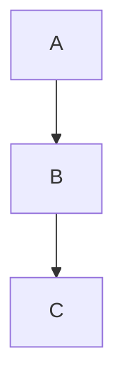

# 边界 torture 文档

一段普通中文段落，包含 **加粗**、*斜体*、`行内代码`、链接 [外部](https://example.com) 与 WikiLink [[核心内容]]。\
上一行的反斜杠是硬换行，必须逐字节保留。

## 链接与嵌入

- 基础 WikiLink：[[核心内容]]
- 别名链接：[[核心内容|显示名]]
- 标题锚点：[[核心内容#小节]]
- 块引用：[[核心内容#^block-anchor]]
- 嵌入文档：![[核心内容#小节]]
- 嵌入图片：![[图片素材.png]]
- Excalidraw 容器：![[系统架构.excalidraw]]

## Callout 与脚注

> [!note] 提示
> 这是 callout 内容，属于 Obsidian 方言。

> [!warning]+ 可折叠警告
> 折叠 callout 第二段。

脚注引用[^1] 与 [^longnote]。

[^1]: 第一个脚注。
[^longnote]: 带名字的脚注，多行内容。

## 任务列表

- [ ] 未完成任务 一 📅 2026-09-05 ^task-t1
- [x] 已完成任务 二 ✅ 2026-09-01 ^task-t2
- [ ] 待办带标签 #g1/子标签 ^task-t3
- [ ] 外部可见任务（供冲突场景使用） ^task-conflict

## 数学与图表

行内公式 $E = mc^2$ 与块公式：

$$
\int_0^\infty e^{-x} dx = 1
$$



## 未知插件语法（必须 passthrough）

```dataview
TASK
WHERE !completed
```

```unknown-plugin
任何未知 fenced 语言都必须原样保留 :: icon=star
```

<!-- 这是 HTML 注释，编辑后必须还在 -->

<div class="raw-html-keep">
  原生 HTML 块内容
</div>

## 表格与 Unicode

| 列 A | 列 B |
| ---- | ---- |
| 🚀 | اَلْعَرَبِيَّةُ |
| 中文 | emoji 👩‍🚀 |

结束段落，用于追加编辑锚点。
