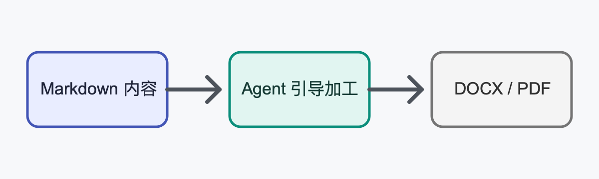

# SuperWagie 技术验证小型报告

## 摘要

本报告验证内容基线经过 Agent 引导后，可以生成结构清晰、来源可追溯并能在真实 WPS 中继续审阅的 DOCX 与 PDF。验证只使用本仓库固定素材，不使用用户个人文档。

## 1. 验证目标

长文档交付必须保留目录、分级编号、表格、插图、来源和明确的交付验收记录。WPS 的真实渲染是版式事实，程序结构检查只负责发现损坏、缺项和正文漂移。

## 2. 交付链路

| 阶段 | 输入 | 输出 | 验收重点 |
|---|---|---|---|
| 内容基线 | 固定 Markdown | 来源清单 | 哈希与版本绑定 |
| 逐章写作 | 来源清单 | 章节草稿 | 每章可追溯 |
| WPS 生成 | 合并稿 | DOCX / PDF | 编号、分页、表格、图片 |
| 真实 Review | 受控副本 | 验收回执 | 编辑、撤销、放弃、重开 |

## 3. 插图

下图是同仓库的固定图片素材，用来验证图片嵌入、尺寸计算和重开后的资源完整性。

:::figure {#fig:delivery caption="SuperWagie 内容交付链路" width="full" kind="diagram"}

:::

## 4. 恢复与一致性

生成过程在 checkpoint 后被终止并重启时，只允许继续未完成阶段。已经提升的 Artifact 不得被重复覆盖，DOCX 与 PDF 的正文顺序必须与本文件保持一致。

## 5. 来源

1. SuperWagie `docs/技术可行性/技术验证执行计划.md`，Gate 3。
2. SuperWagie `rules/deliverables.md`，R-DL-06 至 R-DL-09。
3. 本 fixture 的固定 PNG 图片素材（原始 SVG 同目录保留）。
